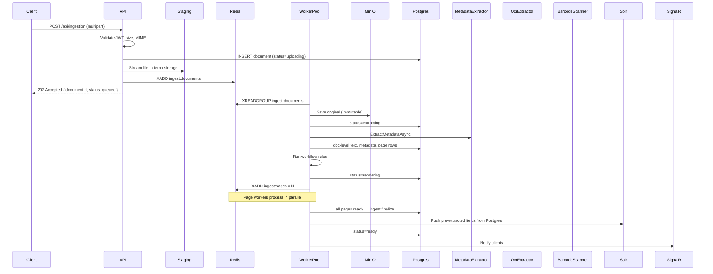
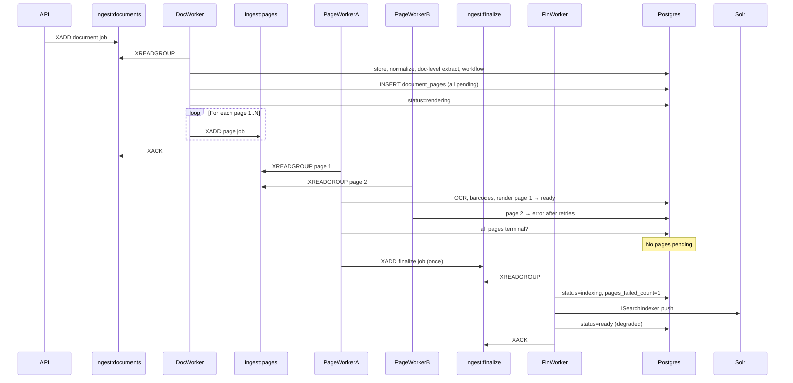
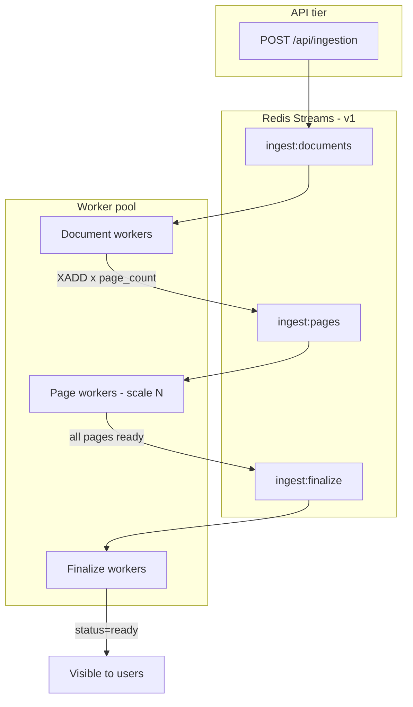
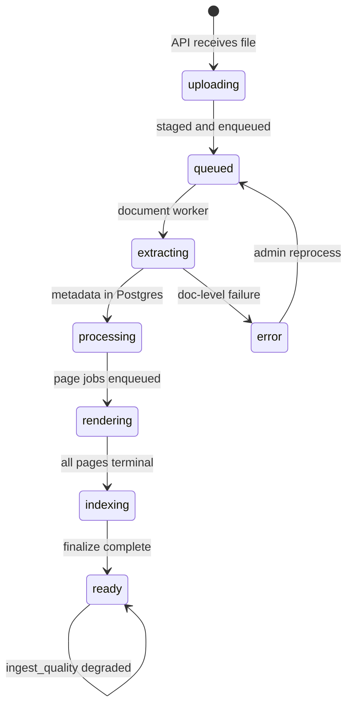

# Document Ingestion Plan

## Goals and constraints

- **Single entry point**: one authenticated API endpoint; desktop, bulk tools, and future integrations all upload through it.
- **Fully async**: HTTP returns as soon as the file is safely received and a job is enqueued—no client wait for extraction or conversion.
- **Postgres is authoritative**: document identity, metadata, ACL, workflow state, extracted text, HOCR references, and barcodes live in Postgres. MinIO holds blobs. Solr is a **push-only, rebuildable search projection**—Solr never parses or extracts document content itself.
- **Immutable originals**: uploaded bytes are never modified; all derived artifacts (PDF, page renders, HOCR) are separate objects keyed by `documentId`.
- **High concurrency**: many documents ingest in parallel across horizontally scaled workers; within a single document, independent extraction tasks run concurrently where safe.
- **Abstraction over implementations**: the pipeline orchestrator and domain logic depend on **ports** (interfaces) in `Scrinium.Core`, not on ZXing, Tika, Tesseract, PDFium, Gotenberg, MinIO, Solr, or Redis directly. Concrete libraries live in **adapters** in `Scrinium.Infrastructure`, wired via DI. Swapping a backend (e.g. a different barcode library or OCR engine) should not change pipeline code.

- **Tag-based organization (no folders)**: documents are organized via a **tagging system**, not folder hierarchy. Tags serve discovery, filtering, and workflow routing. Users apply tags at upload or later; workflow rules auto-tag from metadata and barcodes. Solr indexes tags as multi-valued facet fields for search UI filters.
- **Pages and frames as first-class entities**: multi-page PDFs and multi-frame TIFFs are **fanned out** into individual page/frame records, each with their own renders, HOCR, and barcodes. Pages within a document are linked sequentially by default (`page_number` order). A future **page association** model allows users to link pages across documents (e.g. TIFF frame 2 ↔ PDF page 1)—schema designed now, user-facing API/UI deferred post-v1.

---

## High-level flow



---

## 1. Ingestion API contract

**Endpoint**: `POST /api/ingestion` (extend the existing stub in [`src/Scrinium.Api/Controllers/IngestionController.cs`](src/Scrinium.Api/Controllers/IngestionController.cs))

| Concern | Design |
|---------|--------|
| Auth | Keycloak JWT required (`document:write` or equivalent) |
| Body | `multipart/form-data`: required `file`; optional `tags[]`, `metadata` (see below), `clientReference`, `idempotencyKey` |
| Client metadata | Collection of key/value pairs supplied by the uploading client — data that cannot be extracted from the file itself (source system, batch ID, scanner operator, matter number, etc.). Stored separately from Tika-extracted metadata. |
| Response | `202 Accepted`: `{ documentId, status: "queued", fileName, enqueuedAt }` |
| Limits | Configurable max file size, allowed MIME types, rate limit per user; metadata: max 50 keys, key ≤ 128 chars, value ≤ 4096 chars |
| Idempotency | Optional `idempotencyKey` header/field → if duplicate within TTL, return existing `documentId` without re-processing |

#### Client metadata format

Clients may send key/value pairs using either form:

**Option A — repeated form fields (simple clients):**
```
file: (binary)
metadata[sourceSystem]: SAP
metadata[batchId]: 2026-08-01-001
metadata[matterNumber]: 12345
tags[]: invoices
```

**Option B — single JSON object (bulk/script clients):**
```
file: (binary)
metadata: {"sourceSystem":"SAP","batchId":"2026-08-01-001","matterNumber":"12345"}
```

Rules:
- Keys normalized to lowercase; trimmed; must match `[a-z0-9._-]+` (configurable)
- Values stored as strings; clients stringify numbers/dates themselves
- Duplicate keys → last wins (or reject with `400` — configurable)
- Persisted to `documents.client_metadata` JSONB at accept time (before workers run)
- **Immutable after ingest** for v1 (audit integrity); admin override deferred
- Returned on `GET /api/documents/{id}` alongside `extracted_metadata` (Tika)
- Available to workflow rules, Solr indexing, and admin ingest timeline

**Companion read endpoints** (needed for async UX):

- `GET /api/documents/{id}` — metadata, tags, current status
- `GET /api/documents/{id}/status` — lightweight polling endpoint
- `GET /api/tags` — list tags with document counts (for filter UI)
- `PUT /api/documents/{id}/tags` — add/remove tags post-ingest
- SignalR hub `DocumentProcessingHub` — push status transitions to subscribed clients

Clients (Avalonia, scripts, future bulk uploader) are responsible for gathering files and calling this endpoint repeatedly or in parallel.

---

## 2. Acceptance layer (sync, minimal)

The API handler does only work that must complete before returning:

1. **Authenticate and authorize** — JWT validation; check coarse Keycloak role (`document:write`).
2. **Validate** — file present, size within limit, MIME on allowlist (or sniff magic bytes).
3. **Allocate identity** — generate `documentId` (UUID v7 recommended for sortable IDs).
4. **Persist intent** — insert `documents` row with `status = 'uploading'`, `uploaded_by`, `original_file_name`, `content_type`, `byte_size`, `client_metadata` JSONB (from request key/value pairs). If `tags[]` supplied, insert into `document_tags`.
5. **Stage bytes** — stream to durable temp storage (local disk initially; same pattern as [`IngestionStagingStore`](src/Scrinium.Api/Services/IngestionStagingStore.cs), path `{stagingRoot}/{documentId}/original{ext}`). Do **not** block on MinIO during upload.
6. **Enqueue job** — push `IngestJob` to Redis with `{ documentId, stagingPath, fileName, contentType, uploadedBy, initialTags, clientMetadata, traceId }`.
7. **Audit** — append `document.ingest.queued` to audit log.
8. **Return 202**.

If staging or enqueue fails after Postgres insert, mark document `error` with reason and return `5xx`.

---

## 3. Background pipeline (fully async)

Replace the in-memory [`IngestionQueue`](src/Scrinium.Api/Services/IngestionQueue.cs) / stub [`IngestionBackgroundService`](src/Scrinium.Api/Workers/IngestionBackgroundService.cs) with a **durable step pipeline** orchestrated by a worker process.

### Pipeline steps

| Step | Worker | Status transition | Actions | On failure |
|------|--------|-------------------|---------|------------|
| **StoreOriginal** | Document | `uploading` → `extracting` | Copy staged file → MinIO; delete staging | Retry 3×; then `error` |
| **Normalize** | Document | (within extracting) | Format router; write PDF → MinIO | `error` |
| **Extract** | Document | (within extracting) | Doc-level: `IMetadataExtractor`, `ITextExtractor`; enumerate pages via `IPageEnumerator`; insert `document_pages` (all pending) | Partial OK + warnings |
| **PersistExtraction** | Document | → `processing` | Postgres: metadata, extracted_text, page rows | Retry |
| **Workflow** | Document | (within processing) | Auto-tag from barcodes/metadata/**client_metadata** | Non-fatal |
| **FanOutPages** | Document | → `rendering` | XADD N jobs to `ingest:pages` | Retry enqueue |
| **ProcessPage** | Page | (per page) | OCR, barcodes, render tiers; mark page `ready` or `error` | Page retry; permanent failure → page `error`, other pages continue |
| **Finalize** | Finalize | → `indexing` → `ready` | All pages terminal (ready or error) → Solr index → `ready` + SignalR | Retry index; document visible even if some pages failed |

### Document-level vs page-level work

**Document worker** (`ingest:documents`) — runs once per upload:

| Sub-task | Port | Output |
|----------|------|--------|
| Metadata | `IMetadataExtractor` | `documents.extracted_metadata` |
| Plain text (doc + per-page split) | `ITextExtractor` | `documents.extracted_text`, initial `document_pages.plain_text` where available |
| Page enumeration | `IPageEnumerator` | N `document_pages` rows (`pending`) |
| Workflow | `ITagService` + rules engine | tags |

**Page worker** (`ingest:pages`) — runs N times in parallel across the worker pool:

| Sub-task | Port | Output |
|----------|------|--------|
| HOCR / OCR | `IOcrExtractor` | `document_pages.hocr_*` |
| Barcodes | `IBarcodeScanner` | `document_barcodes` |
| Render tiers | `IPageRenderer` | MinIO WebP tiers; `render_status=ready` |

**Page/frame enumeration** happens after Normalize via `IPageEnumerator` port:
- PDF → page count from PDFium; pages numbered 1..N
- Multi-frame TIFF → one frame per `page_number` (frame index preserved in `document_pages.frame_index`)
- Single JPEG/PNG → one page/frame

**OCR trigger rules**: per page — PDFium text layer empty or below threshold → HOCR that page only. Native single-page images and TIFF frames always get HOCR.

### Per-page fan-out via Redis Streams (v1)

Page-level work is **always** distributed across workers via the `ingest:pages` stream. This maximizes ingest throughput for large PDFs and multi-frame TIFFs. The document becomes visible once **all pages reach a terminal state** (ready or error)—not necessarily all successful.



#### Three Redis Streams (v1)

| Stream | Consumer group | Job unit | Responsibility |
|--------|----------------|----------|----------------|
| `ingest:documents` | `document-workers` | One document | Store original, normalize, doc-level metadata/text extract, workflow, enumerate pages, enqueue page jobs |
| `ingest:pages` | `page-workers` | One page/frame | Per-page OCR, barcodes, render tiers; mark page ready |
| `ingest:finalize` | `finalize-workers` | One document | All pages terminal → Solr index → `status=ready` → SignalR; record `pages_failed_count` |

Page workers scale independently from document workers. A 200-page PDF produces 200 page jobs consumed in parallel across the worker pool.

#### Completion gate (all pages terminal before visible)

**Rule: a document is not visible to system users until `status = 'ready'`.** Processing progress is never exposed, but **`ready` includes degraded documents** where some pages failed permanently.

| Concern | Behavior |
|---------|----------|
| **Browse / search** | Solr indexes `ready` documents (including degraded); optional `hasPageErrors` facet |
| **GET document / pages** | Returns `404` while `status != 'ready'`; once `ready`, successful pages viewable |
| **Failed pages** | Page with `render_status=error` → viewer shows placeholder; no presigned URL for that page |
| **Presigned URLs / viewer** | Issued only when document `ready`; per-page only if that page `render_status=ready` |
| **Progress UX** | Uploader sees step/status via SignalR / `GET .../status` (no page content until `ready`) |
| **Page permanent failure** | Page → `error` with `last_error`; **other pages continue**; document still finalizes |
| **Document-level failure** | Store/normalize/extract failure → document `error` (never visible) |

**Completion detection** (idempotent — safe on page job retry):

1. Page worker finishes → sets page to `ready` **or** `error` (terminal states).
2. Completion check: `SELECT COUNT(*) FROM document_pages WHERE document_id = @id AND render_status = 'pending'`.
3. If count = 0 (all pages terminal) → enqueue **one** finalize job on `ingest:finalize` (guarded by `finalize_enqueued`).

**Finalize sets:**
- `status = 'ready'` — document is now visible
- `pages_failed_count` — number of pages with `render_status = 'error'`
- `ingest_quality = 'complete'` if `pages_failed_count = 0`, else `'degraded'`

Users see the document with failed pages clearly marked; admins can reprocess individual failed pages later.

#### Single-page documents

Same path for consistency: document worker still enqueues one page job on `ingest:pages`. Overhead is negligible; one code path for all document sizes.

**Default linking**: pages within the same document are implicitly ordered by `page_number`. No extra rows needed for the common case.

**Cross-document associations** (future): user links TIFF frame 2 (doc A) to PDF page 1 (doc B) via `page_associations` table—see Section 8. Not required for v1 ingestion; schema reserved so we don't migrate later.

### Revised status enum

```sql
CREATE TYPE document_status AS ENUM (
    'uploading',     -- API receiving / staging
    'queued',        -- staged, waiting for worker
    'extracting',    -- normalize + text/metadata extraction
    'processing',    -- Postgres written, workflow running
    'rendering',     -- page tier generation
    'indexing',      -- Solr indexing
    'ready',
    'error'
);
```

### Orchestration pattern

**Document-level state machine** in Postgres (`documents.processing_step`, `documents.processing_attempts`, `documents.last_error`) plus **page-level status** on `document_pages`. Three Redis Streams with consumer groups coordinate work across workers.

**Parallelism at three levels:**

1. **Across documents** — `ingest:documents` consumers; each claims a different document job.
2. **Across pages** — `ingest:pages` consumers; page jobs from many documents interleave (200-page PDF + 50-page PDF spread across the pool).
3. **Within a page job** — OCR, barcode scan, and render tiers for that page run sequentially or in small parallel batches on one worker.



Document workers do **not** block waiting for pages. They enqueue page jobs and ack. Finalize worker gates visibility.



Note: both `complete` and `degraded` use `status=ready`; `ingest_quality` distinguishes them.

---

## 4. Ports and adapters (abstraction layer)

Follow **hexagonal / ports-and-adapters** architecture. All ingestion orchestration in `Scrinium.Core` depends only on interfaces and domain types—never on third-party SDKs.

```mermaid
flowchart TB
    subgraph core [Scrinium.Core - ports and orchestration]
        Pipeline[IngestionPipeline]
        Router[IFormatRouter]
        Pipeline --> Router
        Pipeline --> IBlobStore
        Pipeline --> IMetadataExtractor
        Pipeline --> ITextExtractor
        Pipeline --> IOcrExtractor
        Pipeline --> IBarcodeScanner
        Pipeline --> IDocumentNormalizer
        Pipeline --> IPageRenderer
        Pipeline --> IJobQueue
        Pipeline --> ISearchIndexer
        Pipeline --> IDocumentRepository
        Pipeline --> IIngestTelemetry
    end
    subgraph infra [Scrinium.Infrastructure - adapters]
        MinIO[MinioBlobStore]
        TikaMeta[TikaMetadataExtractor]
        TikaText[TikaTextExtractor]
        TessOcr[TesseractOcrExtractor]
        ZXingBar[ZxingBarcodeScanner]
        GotenbergNorm[GotenbergNormalizer]
        PdfiumRender[PdfiumPageRenderer]
        RedisQ[RedisStreamJobQueue]
        SolrIdx[SolrSearchIndexer]
    end
    IBlobStore -.-> MinIO
    IMetadataExtractor -.-> TikaMeta
    ITextExtractor -.-> TikaText
    IOcrExtractor -.-> TessOcr
    IBarcodeScanner -.-> ZXingBar
    IDocumentNormalizer -.-> GotenbergNorm
    IPageRenderer -.-> PdfiumRender
    IJobQueue -.-> RedisQ
    ISearchIndexer -.-> SolrIdx
```



### Port definitions (`Scrinium.Core`)

Domain types are library-neutral (no Tika headers, no ZXing types):

```csharp
// Domain result types — owned by Core, not vendors
record DocumentMetadata(IReadOnlyDictionary<string, string> Properties);
record TextExtractionResult(string FullText, IReadOnlyList<PageText> Pages);
record OcrResult(string RawHocr, IReadOnlyList<OcrWord> Words, float? AvgConfidence);
record BarcodeResult(string Symbology, string Value, BoundingBox Bbox, float Confidence);
record PageBitmap(int PageNumber, ReadOnlyMemory<byte> PngBytes, int Width, int Height);

// Ports — ingestion pipeline depends on these only
interface IBlobStore {
    Task PutAsync(string key, Stream content, CancellationToken ct);
    Task<Stream> GetAsync(string key, CancellationToken ct);
    Task DeleteAsync(string key, CancellationToken ct);
    Task<string> GetPresignedUrlAsync(string key, TimeSpan ttl, CancellationToken ct);
}

interface IMetadataExtractor {
    Task<DocumentMetadata> ExtractAsync(Stream content, string mimeType, CancellationToken ct);
}

interface ITextExtractor {
    Task<TextExtractionResult> ExtractAsync(Stream content, string mimeType, CancellationToken ct);
}

interface IOcrExtractor {
    Task<OcrResult> ExtractHocrAsync(PageBitmap page, CancellationToken ct);
}

interface IBarcodeScanner {
    Task<IReadOnlyList<BarcodeResult>> ScanAsync(PageBitmap page, CancellationToken ct);
}

interface IDocumentNormalizer {
    bool CanNormalize(string mimeType);
    Task<Stream> NormalizeToPdfAsync(Stream content, string mimeType, CancellationToken ct);
}

interface IPageRenderer {
    Task<PageBitmap> RenderPageAsync(Stream pdf, int pageNumber, int dpi, CancellationToken ct);
    Task<Stream> RenderTierAsync(Stream pdf, int pageNumber, RenderTier tier, CancellationToken ct);
}

interface IJobQueue {
    Task EnqueueAsync(IngestJob job, CancellationToken ct);
    Task<IngestJob?> DequeueAsync(CancellationToken ct);
    Task AckAsync(string messageId, CancellationToken ct);
    Task NackAsync(string messageId, CancellationToken ct);
}

interface ISearchIndexer {
    Task IndexDocumentAsync(SearchDocument doc, CancellationToken ct);
    Task DeleteDocumentAsync(Guid documentId, CancellationToken ct);
    Task BulkIndexAsync(IAsyncEnumerable<SearchDocument> docs, CancellationToken ct);
}

interface ITagService {
    Task ApplyTagsAsync(Guid documentId, IEnumerable<string> tagNames, TagSource source, CancellationToken ct);
    Task RemoveTagsAsync(Guid documentId, IEnumerable<string> tagNames, CancellationToken ct);
    Task<IReadOnlyList<Tag>> GetTagsForDocumentAsync(Guid documentId, CancellationToken ct);
    Task<IReadOnlyList<TagWithCount>> SearchTagsAsync(string? query, CancellationToken ct);
}

interface IPageEnumerator {
    Task<IReadOnlyList<PageDescriptor>> EnumeratePagesAsync(Stream content, string mimeType, CancellationToken ct);
}
// PageDescriptor: PageNumber, FrameIndex?, SourceKind (pdf_page | tiff_frame | image)

interface IFormatRouter {
    IDocumentNormalizer SelectNormalizer(string mimeType);
    ITextExtractor SelectTextExtractor(string mimeType);
    bool RequiresOcr(string mimeType, TextExtractionResult? priorText);
}
```

### Adapter implementations (`Scrinium.Infrastructure`)

| Port | v1 adapter | Swappable because |
|------|------------|-------------------|
| `IBlobStore` | `MinioBlobStore` | S3, Azure Blob, local filesystem |
| `IMetadataExtractor` | `TikaMetadataExtractor` | In-process Tika, custom parser |
| `ITextExtractor` | Composite: `PdfiumTextExtractor` + `TikaTextExtractor` | Any text engine |
| `IOcrExtractor` | `TesseractOcrExtractor` | Azure Vision, Google OCR, etc. |
| `IBarcodeScanner` | **`ZxingBarcodeScanner`** | Dynamsoft, Scandit, cloud API |
| `IDocumentNormalizer` | `GotenbergNormalizer` | LibreOffice CLI, cloud convert API |
| `IPageRenderer` | `PdfiumPageRenderer` (+ `ImageSharpPageRenderer` for images) | Skia, MuPDF |
| `IJobQueue` | `RedisStreamJobQueue` | RabbitMQ, SQS, Azure Service Bus |
| `ISearchIndexer` | `SolrSearchIndexer` | OpenSearch, Elasticsearch, Meilisearch |

**Rules:**
- Adapters translate vendor output → Core domain types at the boundary. HOCR parsing happens inside `TesseractOcrExtractor`, not in the pipeline.
- Register adapters in DI (`AddScriniumInfrastructure()`); pipeline receives ports via constructor injection.
- Unit-test the pipeline with **in-memory fakes** (`FakeBlobStore`, `FakeBarcodeScanner`, etc.)—no Docker required.
- Config selects adapters: `"Ingestion:BarcodeScanner": "Zxing"` (future-proof for A/B or per-tenant overrides).

### Composite / delegating adapters

Some ports are naturally composite—the router picks the right delegate, but the pipeline still sees one interface:

- **`ITextExtractor`** → `RoutingTextExtractor` delegates to `PdfiumTextExtractor` (PDF) or `TikaTextExtractor` (everything else).
- **`IPageRenderer`** → `RoutingPageRenderer` delegates to PDFium or ImageSharp by MIME type.
- **`IOcrExtractor`** → single adapter today; pipeline calls it only when `IFormatRouter.RequiresOcr()` is true.

---

## 5. Format router

`IFormatRouter` in `Scrinium.Core` selects the right port implementation per MIME type. The router table describes **behavior**; concrete adapters are wired in Infrastructure:

| Input | Normalize | Metadata | Text | OCR | Barcodes | Render |
|-------|-----------|----------|------|-----|----------|--------|
| PDF | passthrough | `IMetadataExtractor` | `ITextExtractor` (PDF path) | `IOcrExtractor` if no text layer | `IBarcodeScanner` | `IPageRenderer` |
| Office | `IDocumentNormalizer` | `IMetadataExtractor` | `ITextExtractor` (Tika path) | `IOcrExtractor` if needed | `IBarcodeScanner` | `IPageRenderer` |
| HTML, EML | `IDocumentNormalizer` | `IMetadataExtractor` | `ITextExtractor` | rarely | `IBarcodeScanner` | `IPageRenderer` |
| JPEG, PNG, TIFF (single frame) | passthrough | `IMetadataExtractor` | — | always `IOcrExtractor` | `IBarcodeScanner` | `IPageRenderer` (image path) |
| TIFF (multi-frame) | passthrough | `IMetadataExtractor` | — | `IOcrExtractor` per frame | `IBarcodeScanner` per frame | `IPageRenderer` per frame |

Multi-frame TIFFs are treated as a **single document with N pages** (one per frame). Each frame gets independent renders, HOCR, and barcode results, fanned out in parallel like PDF pages.

The pipeline never branches on `"ZXing"` or `"Tika"`—it calls `IBarcodeScanner.ScanAsync()` and `IMetadataExtractor.ExtractAsync()`.

---

## 6. Extraction capabilities (via ports)

### Metadata (`IMetadataExtractor`)

**v1 adapter:** `TikaMetadataExtractor` calls Tika `PUT /meta` over HTTP.

| Output field | Stored in |
|--------------|-----------|
| Normalized properties (author, title, created, MIME, embedded props) | `documents.extracted_metadata` JSONB |

- Adapter normalizes Tika response headers into `DocumentMetadata` domain type (strip noisy/internal fields).
- Pipeline and workflow rules consume `DocumentMetadata` only—they never see Tika types.

### Plain text (`ITextExtractor`)

**v1 adapters:** `PdfiumTextExtractor` (PDF text layer), `TikaTextExtractor` (`PUT /tika`), composed via `RoutingTextExtractor`.

| Output field | Stored in |
|--------------|-----------|
| Full document text | `documents.extracted_text` |
| Per-page text | `document_pages.plain_text` |

### OCR and highlighting (`IOcrExtractor`)

**v1 adapter:** `TesseractOcrExtractor` produces HOCR and parses it into `OcrResult` with `OcrWord` bboxes.

HOCR preserves **word-level bounding boxes** for the Avalonia viewer to highlight search hits and support text selection on scanned pages.

**Pipeline per page needing OCR:**
1. `IPageRenderer.RenderPageAsync()` → `PageBitmap` (domain type, not a vendor bitmap).
2. `IOcrExtractor.ExtractHocrAsync(page)` → `OcrResult`.
3. Store raw HOCR → MinIO via `IBlobStore`.
4. Store parsed `OcrResult.Words` → `document_pages.hocr_words` JSONB.
5. Concatenate word text → `document_pages.plain_text`.

**API for viewer**: `GET /api/documents/{id}/pages/{n}/hocr` returns `OcrWord[]` from Postgres. Search hits include page + bbox for overlay rendering.

### Barcodes (`IBarcodeScanner`)

**v1 adapter:** `ZxingBarcodeScanner` — ZXing is an implementation detail hidden behind the port.

Barcodes are scanned from `PageBitmap` during extraction (same render pass as OCR, or a dedicated lower-res scan pass).

**Port returns `BarcodeResult[]` → persisted in `document_barcodes`:**
- `symbology`, `value`, `page_number`, `bounding_box`, `confidence`

Workflow rules consume `BarcodeResult` domain objects. To swap ZXing for another engine, implement `IBarcodeScanner` and change DI registration—pipeline unchanged.

---

## 7. Storage layout (MinIO)

```
documents/{documentId}/
  original/{filename}          # immutable upload
  pdf/normalized.pdf           # canonical PDF for viewing/render
  pages/thumb/page_0001.webp
  pages/preview/page_0001.webp
  pages/full/page_0001.webp
  pages/hocr/page_0001.hocr    # raw Tesseract HOCR (authoritative geometry source)
```

- **Staging** (API temp disk) is ephemeral; deleted after `StoreOriginal` succeeds.
- **HOCR files** are kept alongside renders so geometry can be re-parsed without re-OCR.
- Parsed `hocr_words` JSONB in Postgres is a query-optimized cache; rebuild from MinIO HOCR if schema changes.
- Use S3-compatible SDK with presigned URLs for client download (API enforces ACL).

---

## 8. Data model (Postgres)

Core tables for ingestion (EF Core migrations in `Scrinium.Infrastructure`):

**`documents`**
- `id` UUID PK
- `status` document_status
- `processing_step` VARCHAR — last completed pipeline step
- `original_file_name`, `content_type`, `byte_size`
- `page_count` INT
- `pages_failed_count` INT DEFAULT 0 — set at finalize
- `ingest_quality` VARCHAR — `complete` \| `degraded` (any page errors)
- `finalize_enqueued` BOOLEAN DEFAULT false — idempotency guard for finalize job
- `ingest_started_at`, `ingest_completed_at` TIMESTAMPTZ — wall-clock ingest duration
- `trace_id` VARCHAR — OpenTelemetry trace ID propagated from API through all workers
- `extracted_text` TEXT — full-document plain text for Solr replay and preview
- `extracted_metadata` JSONB — Tika-normalized properties from file (author, title, dates, embedded props)
- `client_metadata` JSONB — key/value pairs from upload client (source system, batch ID, etc.); set at accept time, immutable v1
- `extraction_warnings` JSONB nullable — partial failures per sub-task
- `uploaded_by` UUID, `uploaded_at`, `ready_at`
- `last_error` TEXT nullable
- `idempotency_key` VARCHAR UNIQUE nullable

**`tags`**
- `id` UUID PK
- `name` VARCHAR UNIQUE NOT NULL — normalized lowercase slug (e.g. `invoices`, `invoices-2026`)
- `display_name` VARCHAR — user-facing label (e.g. `Invoices`, `Invoices 2026`)
- `color` VARCHAR nullable — optional UI color hint
- `created_by` UUID, `created_at`

**`document_tags`** (many-to-many)
- `document_id` UUID FK → `documents`
- `tag_id` UUID FK → `tags`
- `source` VARCHAR — `user` | `workflow` | `upload` (who/what applied the tag)
- `applied_at` TIMESTAMPTZ
- composite PK (`document_id`, `tag_id`)

Tag names are normalized on insert (trim, lowercase, collapse whitespace). Hierarchical organization can use naming conventions (`invoices/2026`, `department/hr`) without a folder tree—Solr facets and prefix search on tag names provide grouping in the UI.

**`document_pages`** (one row per page or TIFF frame — first-class entity)

| Column | Purpose |
|--------|---------|
| `document_id`, `page_number` | Composite PK; `page_number` is 1-based display order within the document |
| `frame_index` | Original frame index for multi-frame TIFF (0-based); NULL for PDF pages |
| `source_kind` | `pdf_page` \| `tiff_frame` \| `image` |
| `plain_text` | Searchable page text (PDFium or HOCR) |
| `hocr_object_key` | MinIO path to raw HOCR |
| `hocr_words` | JSONB — parsed word bounding boxes for highlighting |
| `has_text_layer` | true if native PDF text, false if OCR-derived |
| `ocr_confidence` | nullable |
| `render_status` | `pending` \| `ready` \| `error` — per-page render tracking |
| `processing_status` | `pending` \| `ready` \| `error` — per-page OCR/barcode tracking |
| `last_error` | TEXT nullable — page-level failure reason |

Pages are addressable independently: `(documentId, pageNumber)` is the stable key for renders, HOCR, barcodes, and future associations.

**`page_associations`** (cross-document links — schema now, user API deferred)

Allows linking a page/frame in one document to a page/frame in another (or reordering logical groupings):

| Column | Purpose |
|--------|---------|
| `id` | UUID PK |
| `source_document_id`, `source_page_number` | FK → `document_pages` |
| `target_document_id`, `target_page_number` | FK → `document_pages` |
| `association_type` | `related` \| `continuation` \| `alternate_view` (extensible) |
| `label` | optional user note (e.g. "signed copy of page 1") |
| `created_by`, `created_at` | audit |

**Default behavior**: no association rows → pages linked only by sequential `page_number` within their document. Cross-links are **user-created post-ingest** (e.g. associate TIFF frame 2 with PDF page 1 from a different upload). Ingestion pipeline does not create association rows.

**Future API** (not v1): `POST /api/documents/{id}/pages/{n}/associations`, viewer UI to browse linked pages side-by-side.

**`document_barcodes`**
- `id` UUID PK
- `document_id` UUID FK
- `page_number` INT
- `symbology` VARCHAR
- `value` VARCHAR
- `bounding_box` JSONB
- `confidence` FLOAT

**`document_blobs`** (optional normalization of MinIO keys)
- `document_id`, `kind` (original | pdf | page_thumb | hocr | …), `object_key`, `byte_size`, `checksum`

**`ingest_step_log`** (durable per-step timeline — queryable for ops and capacity planning)

| Column | Purpose |
|--------|---------|
| `id` | UUID PK |
| `document_id` | FK → `documents` |
| `page_number` | nullable — NULL for document-level steps |
| `step_name` | e.g. `store_original`, `normalize`, `extract_metadata`, `process_page_ocr`, `process_page_render`, `finalize`, `index_solr` |
| `worker_type` | `document` \| `page` \| `finalize` |
| `worker_id` | hostname/pod id of consuming worker |
| `started_at`, `completed_at` | TIMESTAMPTZ |
| `duration_ms` | computed — **primary metric for step timing** |
| `status` | `success` \| `error` \| `retry` |
| `error_message` | TEXT nullable |
| `trace_id` | correlates with OpenTelemetry trace |
| `metadata` | JSONB nullable — e.g. mime type, page count, retry attempt |

Every pipeline step writes to `ingest_step_log` via `IIngestTelemetry` port (start + complete). Enables queries like: *"how long did document X spend in OCR?"* or *"p95 render time for 200-page PDFs this week"*.

**`audit_log`** — append-only security/business events (already sketched in ARCHITECTURE.md)

**Versioning** (open decision): for v1, treat re-upload as a **new document** unless/until a versioning model is chosen. The pipeline stays the same.

**Permissions** (no folders): document-level ACL only (`document_permissions` table). Tags do not grant access—they are for organization and search only. A user must have document read permission to see a tagged document regardless of which tags they can browse.

---

## 9. Queue and workers (parallel ingestion)

| Component | Responsibility |
|-----------|----------------|
| **`ingest:documents`** | Document orchestration: store, normalize, doc extract, workflow, fan-out page jobs |
| **`ingest:pages`** | Per-page OCR, barcodes, render — **primary throughput scaler** |
| **`ingest:finalize`** | Completion gate: Solr index + `status=ready` (only when all pages done) |
| **`ingest:dlq`** | Dead letter for exhausted retries across all streams |
| **`Scrinium.Workers`** | Processes register to one or more consumer groups (can be specialized or combined) |
| **Horizontal scale** | Add page workers to increase parallel page processing; add document workers for upload burst |
| **Retries** | Per-job exponential backoff; unacked messages reclaimed by other consumers |
| **Reprocess** | Admin replays from appropriate stream (re-enqueue failed pages or whole document) |

**Target concurrency defaults** (tunable via config):

| Setting | Default | Rationale |
|---------|---------|-----------|
| Document worker replicas | 2+ | Handle upload bursts, doc-level extract |
| Page worker replicas | 4+ in prod | **Max ingest rate** — OCR/render bound |
| `MaxConcurrentPageJobs` per replica | 2–4 | CPU/memory per page (OCR + render) |
| Finalize worker replicas | 1–2 | Lightweight; mostly Solr push |

Worker auth: Keycloak **client credentials** service account—not end-user tokens.

### Visibility enforcement (API layer)

All user-facing read paths enforce the completion gate:

- `GET /api/documents` — `WHERE status = 'ready'` only
- `GET /api/documents/{id}` — `404` if not `ready` (unless caller is uploader querying `/status`)
- Search — Solr query includes `status:ready` filter; API double-checks Postgres ACL
- Blob URLs — issued only when parent document `status = 'ready'`

Internal/admin endpoints may list `rendering` / `error` documents for ops dashboards.

---

## 10. Tagging system (replaces folders)

Folders are **out of scope**. Tags are the primary mechanism for organizing, filtering, and grouping documents.

### How tags are applied

| Source | When | Example |
|--------|------|---------|
| **Upload** | User supplies `tags[]` on `POST /api/ingestion` | `["invoices", "vendor-acme"]` |
| **Workflow** | Auto-tag during `processing` step | barcode `INV-*` → tag `invoices`; metadata `Content-Type: application/pdf` → tag `pdf` |
| **Manual** | `PUT /api/documents/{id}/tags` after ingest | User adds/removes tags in desktop UI |

Workflow uses an `ITagService` port (Core) with `ApplyTagsAsync(documentId, tags[], source: Workflow)`. Same service used by API for user-initiated tag changes. Tag changes trigger Solr re-index of that document's tag fields.

### Search and discovery

Solr indexes tags as a **multi-valued string field** with faceting enabled:

```
tags: ["invoices", "invoices-2026", "vendor-acme"]
```

Desktop UI patterns (replacing folder tree):
- **Facet panel** — click tag to filter results (AND/OR configurable)
- **Tag autocomplete** — `GET /api/tags?q=inv` returns matching tags with counts
- **Saved searches** — combine tag filters + full-text query (future; not ingestion scope)
- **Prefix grouping** — tags like `department/hr`, `department/finance` group visually by shared prefix without a folder hierarchy

Search query example: `text:payment AND tags:invoices AND tags:2026`

### Workflow examples (tag-based, not folder-based)

- `if barcode.value startsWith "INV-" → apply tag "invoices"`
- `if metadata.author contains "ACME" → apply tag "vendor-acme"`
- `if mimeType is image/* → apply tag "scanned"`

### What folders were doing → tag equivalent

| Old (folders) | New (tags) |
|---------------|------------|
| Browse by folder tree | Browse/filter by tag facets |
| Move document to folder | Add/remove tags |
| Folder permissions | Document-level ACL only (unchanged per document) |
| Workflow route to folder | Workflow apply tag(s) |
| Search within folder | Search with `tags:X` filter |

---

## 11. Workflow integration

Workflow rules run **after extraction is in Postgres** but **before rendering**:

- Input: `documentId`, `DocumentMetadata` (extracted), **`ClientMetadata`** (upload key/values), `BarcodeResult[]`, extracted text, existing tags, uploader context
- Actions: **apply tags** via `ITagService` (primary), send notification, call webhook
- Example: `if client_metadata.sourceSystem == "SAP" → apply tag "sap-import"`
- Example: `if client_metadata.matterNumber startsWith "LIT-" → apply tag "litigation"`
- Rule failures are **non-fatal** (logged + audit entry); ingest continues
- Rules are JSONB-defined in Postgres, evaluated by `Scrinium.Core` workflow engine

Example: `if barcode.value startsWith "INV-" → apply tags ["invoices", "invoices-{year}"]`.

Tag changes from workflow are indexed to Solr during the normal `indexing` step (tags are read from Postgres at index time).

---

## 12. Search indexing (Solr push-only, fast rebuild)

**Solr never extracts or parses documents.** No SolrCell, no Tika extraction handler, no `/update/extract`. All searchable content is produced by the ingestion pipeline and stored in Postgres first. The worker calls `ISearchIndexer.IndexDocumentAsync()` with a `SearchDocument` domain object—never sends raw files to Solr.

**Index payload** (built from Postgres, passed to `ISearchIndexer`):

| Solr field | Source |
|------------|--------|
| `id` | `documentId` |
| `title` | `extracted_metadata.title` or `original_file_name` |
| `text` | `documents.extracted_text` |
| `pageText` | concatenated `document_pages.plain_text` (optional, for page-scoped search) |
| `author`, `created`, etc. | `extracted_metadata` JSONB |
| `clientMetadata_*` | flattened `client_metadata` keys (e.g. `clientMetadata_sourceSystem`) for faceted search |
| `barcodeValues` | denormalized from `document_barcodes.value` |
| `mimeType`, `tags[]`, `uploadedAt`, `pageCount`, `hasPageErrors` | Postgres |
| `status` | `ready` only indexed for search |

**Fast rebuild strategy:**
1. Admin triggers `POST /api/admin/search/reindex`
2. Worker streams all `ready` documents from Postgres (cursor/batch, e.g. 500 at a time)
3. Bulk index via `ISearchIndexer.BulkIndexAsync()` — no file I/O, no re-extraction, no MinIO reads
4. Optional: parallel bulk workers sharding by document ID range

Rebuild time is bounded by Postgres read + Solr write throughput, not document re-parsing. HOCR and page geometry are **not** indexed in Solr (served from Postgres/MinIO for viewer highlighting).

ACL: API filters Solr results by Postgres ACL after query (v1); optional `allowedPrincipalIds[]` field later.

---

## 13. Client experience (Avalonia)

1. User selects files → client POSTs each to `/api/ingestion` with optional tags (many parallel uploads OK)
2. Client subscribes to SignalR for `documentId` status updates
3. UI states: Queued → Processing → Ready (or Error with retry message)
4. **Browse/filter by tags** — facet panel and tag autocomplete replace folder tree navigation
5. **Viewer highlighting**: on search or text select, fetch `hocr_words` bboxes for the active page and overlay on the preview/full WebP tier
5. **Degraded documents**: if `ingest_quality=degraded`, UI shows warning badge; failed pages display placeholder with reprocess option (admin)
6. **Preview availability**: document **not visible** until `ready`; uploader sees progress via `/status` and SignalR only

---

## 14. Solution structure

Align with planned layout in [`docs/ARCHITECTURE.md`](docs/ARCHITECTURE.md):

| Project | Ingestion responsibilities |
|---------|---------------------------|
| **`Scrinium.Core`** | Domain types, **ports (interfaces)**, `IngestionPipeline`, `IFormatRouter`, `ITagService`, workflow interfaces — **zero third-party deps** |
| **`Scrinium.Infrastructure`** | **Adapters only**: extractors, renderers, `PdfiumPageEnumerator`, `TiffFramePageEnumerator`, blob store, queue, Solr, EF Core repos |
| **`Scrinium.Api`** | Upload endpoint, status/read endpoints, SignalR hub, enqueue via `IJobQueue` |
| **`Scrinium.Workers`** | Hosts `IngestionPipeline`; consumes `IJobQueue`; all extraction via injected ports |

The API and worker can share a process initially (single deployable) but should be **separate DI registrations** so worker can scale out later.

---

## 15. Infrastructure prerequisites

Add to [`docker-compose.yml`](docker-compose.yml) before full pipeline testing:

- **MinIO** — blob storage (originals, PDF, renders, HOCR)
- **Redis** — job queue (Streams + consumer groups)
- **Tika** — metadata (`/meta`) and text (`/tika`) extraction
- **Gotenberg** — format normalization to PDF
- **Tesseract** — either bundled in worker image or sidecar container for HOCR

Postgres and Solr already exist. Solr core schema should use **stored text fields only**—no extraction plugins. Wire connection strings in [`appsettings.Development.json`](src/Scrinium.Api/appsettings.Development.json).

---

## 16. Observability and ingest telemetry (priority)

Tracing and step timing are **first-class requirements**, not an afterthought. They drive capacity decisions (worker count, hardware sizing) and diagnose slow or failed ingests.

### `IIngestTelemetry` port (`Scrinium.Core`)

```csharp
interface IIngestTelemetry {
    IIngestStep BeginStep(IngestStepContext ctx);  // IDisposable or explicit Complete()
}
record IngestStepContext(Guid DocumentId, int? PageNumber, string StepName, string WorkerType);

interface IIngestStep {
    void CompleteSuccess();
    void CompleteError(string message);
    void RecordRetry(int attempt);
}
```

**v1 adapter:** `PostgresIngestTelemetry` writes to `ingest_step_log` + emits OpenTelemetry spans. Pipeline code depends only on the port.

### Trace propagation

1. API generates `trace_id` (W3C Trace Context) on upload → stored on `documents.trace_id`.
2. Every Redis job payload includes `trace_id`.
3. Workers attach `trace_id` to logs, spans, and `ingest_step_log` rows.
4. Single distributed trace spans: API accept → document worker → page workers → finalize.

Use **OpenTelemetry** (.NET `ActivitySource`) with OTLP exporter (Jaeger/Tempo locally; any backend on-prem).

### Structured logging

All worker log entries include:

```
documentId, pageNumber?, stepName, workerType, workerId, traceId, durationMs, status
```

Use `ILogger` scopes so logs are filterable without parsing message text.

### Metrics (OpenTelemetry / Prometheus)

| Metric | Type | Use |
|--------|------|-----|
| `ingest_step_duration_ms` | Histogram (labels: step, worker_type, mime_type) | p50/p95 per step; identify bottlenecks |
| `ingest_document_duration_ms` | Histogram | End-to-end wall clock (upload → ready) |
| `ingest_pages_total` | Counter (labels: status) | Throughput |
| `ingest_queue_lag_ms` | Gauge (labels: stream) | Redis stream consumer lag — **scale workers when lag grows** |
| `ingest_queue_depth` | Gauge (labels: stream) | Pending jobs on `ingest:documents`, `ingest:pages`, `ingest:finalize` |
| `ingest_pages_failed_total` | Counter | Degraded document rate |

### Admin / ops endpoints

| Endpoint | Purpose |
|----------|---------|
| `GET /api/admin/documents/{id}/ingest-timeline` | Step-by-step timeline with durations from `ingest_step_log` |
| `GET /api/admin/ingest/metrics` | Aggregates: avg/p95 step times, queue depth, pages/sec |
| `GET /api/admin/documents?status=rendering` | In-flight documents |
| `POST /api/admin/documents/{id}/pages/{n}/reprocess` | Retry a single failed page |

Example timeline response:

```json
{
  "documentId": "...",
  "ingestQuality": "degraded",
  "totalDurationMs": 45230,
  "traceId": "...",
  "steps": [
    { "step": "store_original", "durationMs": 120, "status": "success" },
    { "step": "normalize", "durationMs": 3400, "status": "success" },
    { "step": "process_page_render", "pageNumber": 47, "durationMs": 890, "status": "error", "error": "..." }
  ]
}
```

### Health checks

Redis, MinIO, Tika, Gotenberg reachable from workers; report queue lag in health endpoint for orchestrators.

---

## 17. Security checklist

- JWT on upload; document-level ACL on create (uploader gets read/write by default)
- Virus/malware scanning — **future** (hook point after `StoreOriginal`)
- Gotenberg: disable JS in Chromium (already noted in ARCHITECTURE.md)
- Staging directory permissions; cleanup on failure
- Presigned MinIO URLs time-limited; API checks Postgres ACL before issuing

---

## 18. Implementation phases

Recommended build order (each phase is independently testable):

1. **Foundation** — Core ports + domain types; Postgres schema (incl. tags, `ingest_step_log`); `IIngestTelemetry`; queue adapters
2. **Metadata + text + tags + telemetry** — extractors; `ITagService`; step logging from day one; status API + SignalR
3. **HOCR + barcodes** — `IOcrExtractor`, `IBarcodeScanner` adapters; parallel extract via ports; semaphores
4. **Render** — `IPageRenderer` adapter; viewer with HOCR highlight overlay
5. **Search** — `ISearchIndexer` adapter; bulk reindex from Postgres
6. **Parallel workers** — three-stream model; page worker scaling; completion gate (terminal pages)
7. **Workflow** — tag-based rule engine
8. **Observability** — OpenTelemetry export, metrics dashboards, admin ingest-timeline API
9. **Hardening** — fakes, idempotency, retries, DLQ, per-page reprocess

---

## Key design decisions captured

| Decision | Choice |
|----------|--------|
| Entry points | Single `/api/ingestion` endpoint |
| Sync vs async | Fully async—all processing in workers |
| Concurrency | Redis Streams consumer groups; parallel port calls; scale workers horizontally |
| Architecture | Ports/adapters — pipeline depends on interfaces; vendors in Infrastructure |
| Source of truth | Postgres (text, metadata, HOCR words, barcodes) |
| Metadata | `IMetadataExtractor` → `extracted_metadata`; client key/values → `client_metadata` at upload |
| OCR / highlighting | `IOcrExtractor` → HOCR + bboxes (v1: Tesseract adapter) |
| Barcodes | `IBarcodeScanner` → `document_barcodes` (v1: ZXing adapter) |
| Solr role | `ISearchIndexer` push-only from Postgres; no Solr extraction |
| Blob storage | MinIO (S3-compatible) |
| Queue | Redis Streams: `ingest:documents`, `ingest:pages`, `ingest:finalize` |
| Visibility | Not visible until `ready`; degraded docs (some page errors) still visible |
| Page failure | Page → `error`; other pages continue; document finalizes as `degraded` |
| Observability | **Priority** — `ingest_step_log`, OpenTelemetry traces, step duration metrics, queue lag |
| Page fan-out | v1 via `ingest:pages`; scales across worker pool |
| Organization | Tags only — no folders; facets + filters in Solr |
| Pages/frames | First-class per-page records; fan-out OCR/render/barcode; multi-frame TIFF = N pages |
| Page associations | Schema reserved; default sequential order; cross-doc links user-defined post-ingest |
| Permissions | Document-level ACL; tags are not access controls |
| Workflow timing | After extraction, before rendering; primary action is auto-tag |
| Versioning | New document per upload for v1 |

### Pre-implementation decisions (locked)

| Decision | Choice |
|----------|--------|
| Project structure | **Full split from day 1** — `Scrinium.Core`, `Scrinium.Infrastructure`, `Scrinium.Workers` + existing `Scrinium.Api` |
| Auth on ingestion | **JWT required from phase 1** — Keycloak via `Microsoft.AspNetCore.Authentication.JwtBearer` |
| Tesseract deployment | **Decide at HOCR phase (3)** — not blocking foundation work |

## Open items (defer, do not block v1)

- Multi-tenancy model
- Document versioning vs new-document-per-upload
- Virus scanning integration
- Tesseract in worker image vs sidecar container
- Solr-side ACL vs API-side filter-only
- Tag permission model (who can create/rename/delete tags vs apply tags)
- Page association UI/API (cross-document links; schema ready, feature deferred)
- Client metadata mutability (immutable v1 vs editable post-ingest)
- Client metadata key allowlist/registry per deployment
