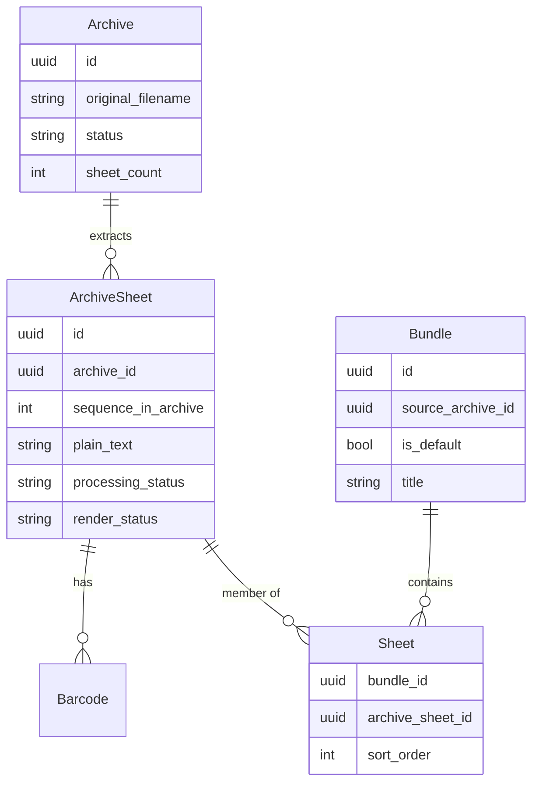
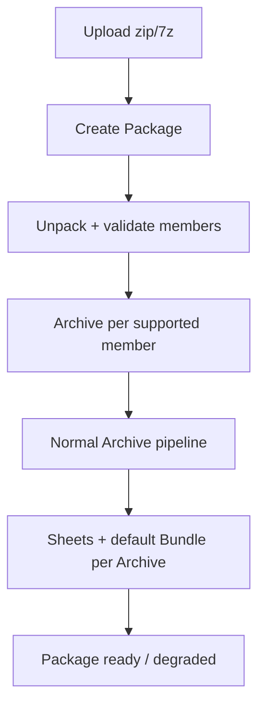

# Archive → Sheet → Bundle model

**Status:** Design discussion (not implemented). Use this doc to resume architecture/planning work.

**Related:** [Document Ingestion Plan](../.cursor/plans/document_ingestion_plan_d982dc40.plan.md) (implementation details for workers, ports, Redis streams).

**Last updated:** 2026-08-01 — Archive / Bundle / Package; tables **`archive_sheets`** + **`sheets`** (membership); Option B; Package B1; visibility gate locked.

---

## Summary

Shift from **“upload = document”** to **“upload = archive that yields many independent sheets.”** A **bundle** is a user-facing, ordered grouping of sheets — not the ingested file itself.

**Chosen for v1:** **Option B** — on ingest, auto-create a **default bundle** containing all sheets in archive (frame/page) order. That default bundle represents the uploaded archive. User reorganizes later (split, reorder, pull sheets from other archives into other bundles).

**Visibility:** a Bundle is **not library-visible** until all member sheets are terminal (`ready`, including degraded if some sheets failed). See [Visibility / completion gate](#visibility--completion-gate-locked).

**Compound uploads (zip/7z):** treat as a **Package** that expands into **multiple Archives**, each of which follows the normal Archive → Sheet → Bundle pipeline. Do **not** flatten every nested PDF page into one mega-archive of sheets.

---

## Terminology (locked)

| Term | Meaning |
|------|---------|
| **Archive** | One ingestible **content file** (PDF, TIFF, DOCX, PNG, …). Immutable original (+ normalized PDF). Provenance + leaf enumeration unit. |
| **Archive sheet** | One extracted leaf: PDF page *n*, TIFF frame *n*, DOCX page *n*, or a single image. Stored in `archive_sheets`. Atomic unit for OCR, barcodes, renders, and **primary search index**. |
| **Sheet** | Membership of an archive sheet in a **Bundle** (`sheets` table: order + link). What you navigate inside a Bundle. |
| **Bundle** | Composed, ordered group of sheets. What the library UI lists. Default bundle created at ingest to represent that archive; users create more bundles later. |
| **Package** | Upload of a **container format** (zip / 7z / …). Holds the container blob; expands into child **Archives**. Not the same thing as our domain “Archive.” |

Avoid overloading **document** / **page** in domain code — use **archive / sheet / bundle / package**. “Page” / “frame” are fine in UI copy when describing a sheet’s origin. Never call a zip an “Archive” in domain language — that name is already taken.

### Ingest flows (two sentences)

1. **Single file:** Upload an **Archive** → split into **Sheets** → create a **default Bundle** in archive order.
2. **Container file:** Upload a **Package** (zip/7z) → unpack members → each supported member becomes an **Archive** → each archive gets its own sheets + **default Bundle** (**B1**: one Bundle per member; Package is a filter, not a Bundle).

---

## Target mental model

```text
Upload
  └── Archive (provenance, blobs, ingest status)
        └── Sheets 1..N (extracted, each indexed in Solr)
              └── Default Bundle (membership: sheet 1..N in archive order)
                    └── User may later: reorder, split, move sheets into other bundles
```



**Table naming:** extracted leaves live in **`archive_sheets`**; Bundle membership lives in **`sheets`** (`BundleId`, `ArchiveSheetId`, `SortOrder`).
---

## Option B — default bundle on ingest

When fan-out runs after archive enumeration:

1. Create **N `archive_sheets` rows** (`SequenceInArchive` 1..N).
2. Create **one default bundle** linked to `SourceArchiveId`, `IsDefault = true`, title ≈ original filename.
3. Insert **N `sheets` rows** (membership) with `SortOrder = SequenceInArchive` (preserves frame/page order).

**Rules:**

- Removing a membership row from `sheets` **does not** delete the `archive_sheets` row or change the archive.
- Archive view always shows full original order (`ArchiveId` + `SequenceInArchive` on `archive_sheets`).
- Default bundle is the **working copy** that represents the upload; archive is **audit/provenance**.
- Prefer **disallow hard-delete** of default bundle until user creates another bundle from those archive sheets (product detail TBD).

**Edge cases:**

- Single JPEG / 1-page office PDF → archive with 1 `archive_sheets` row, default bundle with 1 `sheets` membership.
- Multi-frame TIFF → N `archive_sheets`, one default bundle with N `sheets` rows in frame order.

---

## Visibility / completion gate (**locked**)

**Rule: a Bundle is not library-visible until `status = ready`.**

`ready` means **every member sheet is terminal** (`ready` or `error`) — not that every sheet succeeded.

| Situation | Bundle status | Library / search visible? |
|-----------|---------------|---------------------------|
| Any member sheet still pending / processing | not `ready` | **No** |
| All member sheets succeeded | `ready` | **Yes** |
| Some sheets failed permanently; rest succeeded | `ready` + degraded (`ingest_quality = degraded`, `sheets_failed_count > 0`) | **Yes** — failed sheets show placeholders; no render URL for those sheets |
| Archive failed before sheets were created | Bundle never becomes `ready` (or archive `error`) | **No** |

**What stays hidden while processing**

- Library list / browse
- Solr index for that Bundle (index only when Bundle becomes `ready`, including degraded)
- Opening the Bundle as a finished stack

**What is allowed while processing**

- Uploader progress via status API / SignalR (no sheet content)
- Internal admin / ingest telemetry

**Completion detection (idempotent)**

1. Sheet worker finishes → sheet `ready` or `error` (terminal).
2. Check: no member sheets of this Bundle still pending.
3. If count = 0 → mark Bundle `ready` (set degraded flags if any sheet `error`); enqueue finalize/index once (guarded).

**Package + B1**

Each member file has its **own** default Bundle. Visibility is **per Bundle**:

- `invoice.pdf` Bundle can become visible while `scan.tif` Bundle is still processing.
- Package status is separate: Package `ready` / `degraded` when **all child Archives** are terminal; Package is a filter facet, not a visibility unit for the library list.

**Provenance views** (Archive / Package detail for the uploader or admin) may show in-progress state; that does not make the Bundle appear in the shared library until `ready`.

---

## Package uploads (zip / 7z / real container formats)

### Problem

Our domain word **Archive** means “one content file we unpack into sheets.” A user zip of `invoice.pdf` + `scan.tif` + `photo.png` is a **different** kind of unpacking:

| Level | What you unpack | Yields |
|-------|-----------------|--------|
| Package (zip) | Member **files** | Child **Archives** |
| Archive (PDF/TIFF/…) | Pages / frames | **Sheets** |

Flattening a zip into one Archive of mixed sheets is wrong: you’d lose per-file identity, mix unrelated content, and make “default bundle = zip order” ambiguous across multi-page members.

### Recommended model

```text
Upload packet.zip
  └── Package (stores zip blob, status, member list)
        ├── Archive: invoice.pdf  → Sheets 1..N  → default Bundle A
        ├── Archive: scan.tif     → Sheets 1..M  → default Bundle B
              └── Archive: photo.png    → Sheet 1      → default Bundle C
                    (Package itself is not a Bundle; filter by package_id)
```



### Pipeline steps (Package worker)

| Step | Action | On failure |
|------|--------|------------|
| `store_package` | Save zip/7z to MinIO; create `packages` row | Package `error` |
| `enumerate_members` | List entries; filter junk (`__MACOSX`, `.DS_Store`, dirs); record path + size + mime guess | Partial OK + warnings |
| `extract_members` | Stream members to staging / MinIO as child Archive originals | Per-member `error`; continue others |
| `enqueue_archives` | Enqueue normal `ingest:archives` job per child Archive (`package_id`, `member_path`) | Retry enqueue |
| *(no package Bundle)* | B1: each child Archive creates its own default Bundle via the normal pipeline | — |

Child Archives reuse the **existing** Archive → Sheet → Bundle pipeline unchanged. Package is orchestration + provenance only.

### Bundle behavior for packages (**chosen: B1**)

| Option | Behavior | Status |
|--------|----------|--------|
| **B1 — Per-member only** | Each child Archive gets its own default Bundle. Package is a browse/filter facet (`package_id`), not a Bundle. | **Chosen** |
| **B2 — Package Bundle only** | One Bundle with every sheet from every member; no per-file default bundles | Rejected |
| **B3 — Both** | Per-member default Bundles **and** a Package Bundle that unions all sheets | Deferred / not planned |

**Decision:** zip/7z expands into **one default Bundle per member file**. There is no auto-created “whole package” Bundle. Users who want a combined stack can create a Bundle later and add sheets from multiple member Archives.

Example: `packet.zip` with `invoice.pdf`, `scan.tif`, `photo.png` → library shows **3 Bundles** (one per file). Filter/browse by Package to see they came from the same upload.

---

### What to store on Package / child Archive

**Package:** `id`, original filename, blob key, status, `member_count`, `members_failed_count`, uploaded_by, trace_id.

**Package member (or fields on Archive):** `package_id`, `member_path` (e.g. `folder/invoice.pdf`), `member_index`, status.

**Archive:** same as today, plus optional `package_id` for “show everything from this zip.”

### Ordering

1. Prefer **zip entry order** as default package order (stable, matches many scanners’ export).
2. Optional later: alphabetical by `member_path`, or folder-aware grouping.
3. Persist `member_index` so reprocess doesn’t reshuffle.

### Nested containers

| Policy | Behavior |
|--------|----------|
| **v1** | Nested zip/7z → member marked `unsupported` / warning; do not recurse |
| **Later** | Recurse with depth limit (e.g. 2) and max total members |

### Unsupported / skipped members

- Unknown mime, encrypted zip entries, password-protected PDFs, empty files → record warning on Package; don’t fail the whole package.
- Package status: `ready` (all members terminal), `degraded` (some failed), `error` (unpack itself failed).

### Security / ops (must-haves before enabling zip)

- Path traversal: reject `../`, absolute paths, Windows drive prefixes.
- Zip bombs: max compressed size, max uncompressed total, max member count, max compression ratio.
- Timeouts on extract; no write outside staging/MinIO keys scoped to `package_id`.
- Prefer streaming extract; don’t load whole zip into memory.

### Port sketch

```text
IPackageExtractor
  EnumerateAsync(stream) → PackageMemberInfo[]
  ExtractMemberAsync(stream, memberPath) → Stream  // original bytes for child Archive
```

Adapters: SharpCompress / System.IO.Compression for zip; SharpCompress for 7z. Format router classifies upload as `Package` vs single `Archive` before enqueue.

### Implementation order (packages)

Defer until single-file Archive → Sheet → Bundle works.

1. `packages` + `package_id` on archives; enumerate + extract zip only.
2. Enqueue child Archives; **B1** (per-member default bundles only).
3. Package status aggregation when all children terminal.
4. 7z + nest policy + richer UI (“these Bundles came from package X”).

### Open package decisions

1. ~~**B1 vs B3**~~ — **B1 chosen** (one Bundle per member file; no package Bundle).
2. **Nested zip** — reject vs recurse (recommend reject in v1).
3. **Folder paths in zip** — tags? metadata only? ignore?
4. **Same filename twice** in zip — disambiguate by `member_path` / unique archive id.

---

## Bundle table vs self-referencing sheets

**Question:** Do we need a `bundles` table, or only a self-referencing `sheets` table?

**Conclusion:** You need **three concepts**; you can implement “bundle” as either a **`bundles` table** or a **container row** in `sheets` (`kind = bundle`). Do **not** rely on `parent_id` alone.

Each **leaf sheet** has two relationships:

| Relationship | Column / table | Mutable? |
|--------------|----------------|----------|
| Provenance | `archive_sheets.ArchiveId`, `SequenceInArchive` | No |
| Organization | `sheets` membership (`BundleId`, `ArchiveSheetId`, `SortOrder`) | Yes |

**Recommendation (lean):**

| Concept | Table |
|---------|--------|
| Archive | `archives` |
| Extracted leaf | `archive_sheets` |
| Bundle | `bundles` |
| Bundle membership | `sheets` (`BundleId`, `ArchiveSheetId`, `SortOrder`) |
| Barcodes | `sheet_barcodes` → `archive_sheets` |

**Alternative:** `archive_sheets` / containers mixed in one table with `kind` — rejected; prefer explicit tables above.

**Not recommended:** Pure tree (`parent_id` only) without `ArchiveId` on `archive_sheets` — breaks fixed archive order vs mutable bundle membership.

---

## Worker responsibilities (target)

### Archive worker (`ingest:archives` — today `ingest:documents`)

Runs **once per upload**:

| Step | Output |
|------|--------|
| `store_original` | MinIO original blob |
| `normalize` | MinIO normalized PDF (if applicable) |
| `extract_pdf_metadata` | PdfPig info dict (PDF only) |
| `resolve_page_count` / enumerate | `archive.sheet_count`, create sheet rows |
| `extract_metadata` | Tika on original → archive metadata |
| `fan_out_sheets` | N jobs on `ingest:sheets`, create **default bundle** + memberships |

**Does not:** per-sheet text (PDF), barcodes, renders, OCR.

### Sheet worker (`ingest:sheets` — today `ingest:pages`)

Runs **once per sheet** (parallel):

| Step | Output |
|------|--------|
| `load_sheet_source` | Bytes from normalized PDF or original |
| `rasterize_sheet` / `decode_image` | Bitmap |
| `scan_sheet_barcodes` | `sheet_barcodes` (FK → `archive_sheets`) |
| `extract_sheet_text` / `ocr_sheet` | `archive_sheets.PlainText`, HOCR |
| `upload_sheet_renders` | MinIO thumb/preview/full |
| Index sheet | Solr doc per `archive_sheets` row |

**Does not:** archive metadata, normalization, archive completion logic.

### Finalize worker

| Step | Output |
|------|--------|
| Archive completion | All sheets terminal → archive `ready` |
| Per-sheet or batch Solr | Already indexed per sheet (TBD) |
| Workflow / auto-tags | Read aggregated barcodes + metadata → tags |
| Default bundle | Mark `ready` when **all** member sheets terminal (including degraded); not library-visible before that — see [Visibility / completion gate](#visibility--completion-gate-locked) |

Open: whether **bundle** gets its own Solr aggregate or search stays sheet-first with bundle = UI view over memberships.

---

## Indexing strategy

**Primary:** one Solr document **per `archive_sheets` row** (`archive_sheet_id`, `archive_id`, `sequence_in_archive`, text, barcodes, tags).

**Facets / filters:**

- `archive_id` — “everything from this upload”
- `bundle_ids` (denormalized from `sheets` membership) — “which bundles include this archive sheet”

**Bundle-level Solr:** defer until “search within this bundle only” is required; v1 can query sheets by membership.

---

## Current implementation (as of 2026-08-01)

**Still the old model:** one `documents` row per upload, `document_pages` as composite `(document_id, page_number)`.

**Already aligned with sheet-level processing (partial):**

- Page worker sub-steps: `load_page_source`, `rasterize_page`, `decode_image`, `upload_page_renders`, `extract_page_text`, `scan_page_barcodes`
- Document worker sub-steps: `store_original`, `extract_pdf_metadata`, `resolve_page_count`, `extract_metadata`, `extract_tika_text` (office/web only), `fan_out_pages`
- `document_barcodes` table (in initial migration) with page FK — move to sheet FK in new model
- `ingest_step_log` with optional `page_number` — becomes `sheet_id` or keep sequence
- DB blown away between dev runs; initial migration updated manually (no incremental migrations policy)

**Known fixes landed (same timeframe):**

- Upload `PageCount = 0` until extraction; fan-out uses real PDF page count
- Barcodes: all pages scanned (no `MaxBarcodeScanPages` cap)
- PDF text removed from document worker; only per-page `extract_page_text`

**UI:** Avalonia lists `GET /api/documents`, page viewer — maps to **default bundle + sheets** later (`GET /api/bundles`).

---

## Gap: current schema → target schema

| Today | Target |
|-------|--------|
| `documents` = upload | `archives` = upload; `bundles` = composed grouping |
| `document_pages` composite PK | `archive_sheets` with own `Id` (UUID) |
| `document_barcodes` → page | `sheet_barcodes` → `ArchiveSheetId` |
| (no membership table) | `sheets` = bundle membership (`BundleId`, `ArchiveSheetId`, `SortOrder`) |
| One Solr doc per upload | One Solr doc per `archive_sheets` row |
| `ingest:documents` / `ingest:pages` | Rename conceptually to archives / archive-sheets (streams can keep names initially) |
| `FinalizeIngestionWorker` indexes whole doc | Bundle completion gate + per-archive-sheet indexes |

**Migration approach (dev):** replace initial migration / entities when implementing; no prod migration path yet.

---

## Open product / tech decisions

1. **Sheet in multiple bundles?** Default: **no** — copy sheet if needed; junction table allows M:N if policy changes.
2. **Re-index on membership change?** Update denormalized `bundle_ids` on sheet Solr docs.
3. **Replace vs version** when re-uploading a corrected page? Sheet versioning / supersede links — TBD.
4. **ACL:** bundle-level v1; archive readable if user can read any contained sheet — TBD.
5. **Office/HTML text:** move Tika text to sheet worker (even when N=1) for consistency — recommended, not done.
6. **Split `processing_status` vs `render_status`** on sheets — plan calls for separate OCR vs render tracking; today both set together in page worker.
7. **Workflow timing:** run auto-tag rules in finalize after all sheet barcodes exist (not archive extract phase).
8. **Package uploads (zip/7z):** **B1 chosen** (one Bundle per member); nested zip policy; folder path → tags? — see [Package uploads](#package-uploads-zip--7z--real-container-formats).

---

## Recommended implementation order

1. **Schema:** `archives`, `archive_sheets`, `bundles`, `sheets` (membership), `sheet_barcodes`; barcodes FK → `archive_sheets`.
2. **Ingest:** archive worker creates `archive_sheets` + default bundle + `sheets` memberships at fan-out.
3. **Workers:** rename jobs `PageIngestJob` → sheet job keyed by `ArchiveSheetId`.
4. **Solr:** index per `archive_sheets` row; `archive_id` / `bundle_ids` facets.
5. **API:** list only `ready` bundles; GET archive + `archive_sheets` for provenance/progress view.
6. **UI:** library lists `ready` bundles; open default bundle navigates `sheets` by `SortOrder` (placeholders for failed archive sheets).
7. **Later:** split/merge/reorder APIs, bundle Solr aggregate, sheet versioning.
8. **Later:** Packages (zip/7z) → child Archives → **B1** per-member default Bundles (no package Bundle).

---

## Resume checklist

When picking this up again:

- [x] Terminology: **Archive / Sheet / Bundle** (not Document).
- [x] **Option B** — default bundle on ingest representing the archive in frame/page order.
- [x] **Packages** — zip/7z expand into child Archives (not flattened into one Archive of sheets).
- [x] Package bundle policy **B1** — one default Bundle per member file; Package is a filter/facet, not a Bundle.
- [x] **Visibility gate** — Bundle not library-visible until all member sheets terminal (`ready`, including degraded).
- [x] **Tables:** `archive_sheets` = leaves; `sheets` = bundle membership (`ArchiveSheetId`).
- [ ] Update [Document Ingestion Plan](../.cursor/plans/document_ingestion_plan_d982dc40.plan.md) § “Document-level vs page-level work” to archive/sheet/bundle language.
- [ ] Implement schema + fan-out default bundle before UI reorganize features.
- [ ] Grep codebase for `document_pages`, `PageIngestJob`, `ExtractedText` on document for PDFs.

---

## Conversation anchor

This model came from:

- Finer-grained ingest telemetry (document vs page steps).
- Moving barcodes and PDF text to page level → natural step toward **sheets as first-class indexed units**.
- Treating ingest like **unpacking an archive** (TIFF frames, PDF pages, DOCX pages).
- User preference: **Option B** — default **bundle** in archive order, organize later.
- Terminology: **Bundle** instead of Document — avoids conflating “uploaded file” with “working grouping of sheets.”
- Schema question: **`archive_sheets`** (leaves) + **`sheets`** (bundle membership) — not self-referencing parent alone.
- Real zip/7z uploads: introduce **Package** so domain “Archive” stays “one content file,” not “zip container.”
- Package Bundle policy: **B1** — one Bundle per member file; combine later manually if needed.
- **Visibility:** Bundle library-visible only when all member sheets are terminal (`ready` / degraded OK).
